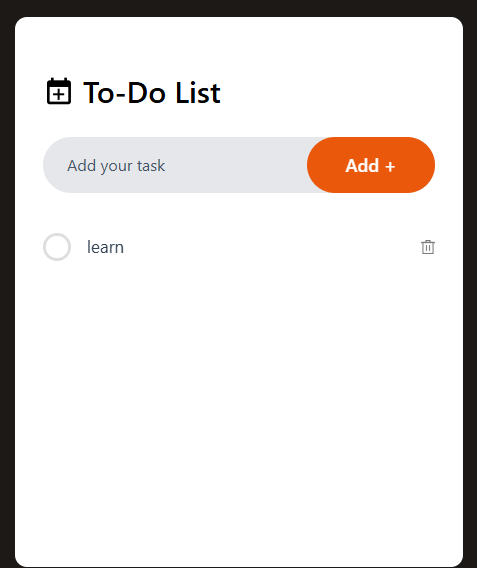

# To Do List App Using React js And Tailwind Css
This is a clone project from greatStackDev for learn and apply React Js,tailwind as a project
# Feature
1. React
2. Tailwind
3. Vite
# clone project 

**Cloning and Running the Project**

1. **Clone the Repository**

   *   **Using Git:**
       ```bash
       git clone https://github.com/abidsarkar/To-Do-List-App-Using-React-JS-And-Tailwind-CSS.git
       ```

   *   **Using GitHub Desktop:** 
       Clone the repository using GitHub Desktop.

2. **Install Dependencies**

   ```bash
   npm install 
   ```
   or
   ```bash
   yarn install
   ```

3. **Start the Development Server**

   ```bash
   npm run dev 
   ```
   or
   ```bash
   yarn dev
   ```

   This will start a development server (usually on `http://localhost:5173`) and open the project in your browser..

4. **Build for Production**

   ```bash
   npm run build
   ```
   or
   ```bash
   yarn build
   ```

**Key Considerations:**

*   Review the project's structure and file organization.
*   Customize Tailwind configuration in `tailwind.config.js` (if needed).
*   Create a `.env` file for environment variables (if applicable).
*   Refer to the `package.json` file for custom scripts.

This version is more concise and better suited for a README.md file. You can further enhance it by:

*   Adding screenshots of the project.
*   Providing a brief project description.
*   Including a section on contributing to the project.
*   Adding a section on troubleshooting common issues.

I hope this helps!

# React + Vite

This template provides a minimal setup to get React working in Vite with HMR and some ESLint rules.

Currently, two official plugins are available:

- [@vitejs/plugin-react](https://github.com/vitejs/vite-plugin-react/blob/main/packages/plugin-react/README.md) uses [Babel](https://babeljs.io/) for Fast Refresh
- [@vitejs/plugin-react-swc](https://github.com/vitejs/vite-plugin-react-swc) uses [SWC](https://swc.rs/) for Fast Refresh
